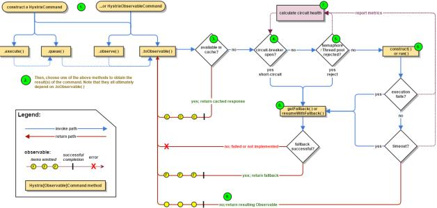

#### hvstrix 
```
pom.xml中添加
        <dependency>
            <groupId>org.springframework.cloud</groupId>
            <artifactId>spring-cloud-starter-hystrix</artifactId>
        </dependency>


//开启注册
@EnableDiscoveryClient
//开启熔断器
@EnableCircuitBreaker
@SpringBootApplication
//一个顶上面三个
//@SpringCloudApplication
public class StartCommon {}
```
####流程

* 1:创建command
创建HystrixCommand(依赖服务返回单个结果)或 HystrixObservableCommand(依赖服务返回多个结果)
* 2:执行 command
AbstractCommand:  
observe() 返回observable对象
toObservable() 获取 observable 对象
HystrixCommand:  extends AbstractCommand
execute()同步执行 底层直接调用queue().get()  
queue() 异步执行 返回future对象   通过获取observable对象 来转换成future对象
HystrixObservableCommand:  extends AbstractCommand
construct() 返回 Observable对象   
* 3:结果是否被缓存
如果请求的被缓存  直接返回 observable对象 
* 4:判断断路器情况
断路器打开状态: 执行fallback
断路器关闭状态: 继续执行 
* 5:线程池、队列、信号量是否占用满  
 如果 线程池(依赖服务的线程池非容器线程池)、队列、信号量被占满 直接执行 fallback 
* 6:请求服务  
HystrixCommand.run()  返回单一结果 或者异常 返回一个Observable 发射单个结果
HystrixObservableCommand.construct() 直接返回Observable
如果超时  直接忽略后续的run或者construct的结果
* 7: 断路器健康程度
hystrix 会根据成功、失败、拒绝、超时等信息 判断是否打开熔断器 
* 8:fallback处理 熔断处理 服务降级处理  
1): command 再短路状态 断路器打开的时候  
2): command的线程池、队列、信号量 占满  
3): Command请求发生异常的时候  
HystrixCommand 通过调用getFallback来降级
HystrixObservableCommand 通过Observable 发射一个或者多个降级结果
* 9: 成功的响应
command 执行成功都返回一个Observable 对象 通过不同的命令去做不同的处理
#### 源码
HystrixCircuitBreaker(熔断器)  
allowRequest(); command 是否请求
isOpen(); 断路器是否打开
markSuccess();闭合断路器 
static class Factory{}  建立一个ConcurrentHashMap<命令名称,熔断器对象>  类似一个缓存的东西 
static class HystrixCircuitBreakerImpl implements HystrixCircuitBreaker{}实现 HystrixCircuitBreaker   
如果这个断路器 是打开状态 然后此次请求间隔大于circuitBreakerSleepWindowInMilliseconds 进入半开状态 此时允许发起请求 如果成功关闭断路器  如果失败 继续打开断路器 刷新记录时间
static class NoOpCircuitBreaker implements HystrixCircuitBreaker{}  始终关闭的断路器 允许任何请求  
####依赖隔离 舱壁模式 
优势:  
1：某个服务的线程池填满  不影响应用的其他服务
2:引入新服务 不影响 其他服务 
3:依赖服务 失效回复 线程池马上恢复健康 比容器级别的恢复要快速
4:依赖服务出现配置错误 该服务的线程池 马上反映问题 可以通过 confnig、bus等模块 不影响应用其他功能的情况下 恢复
5：依赖服务因为调整配置导致性能变化 可以通过实时刷新阀值配置来调整
6:利用服务线程隔离实现异步访问
线程隔离会增大开销 但是影响不大 如果非要纠结这个  可以使用信号量提高并发量
command 中支持信号量的地方
* 设置隔离策略 execution.isolation.strategy：SEMAPHORE hystrix使用信号量来控制依赖服务的并发
* 当进行降级的时候 汇再调用线程中使用信号量
信号量 默认 10 
#### 自定义command 
类似hystrixCommand 
类似 hystrixObservableCommand 方式

#### 服务降级
在实现的command 中重写 getFallBack方法 
```
  @Override
    protected String getFallback() {
        return "command 降级";
    }
```
注解的话直接指定方法名称 注意:必须是本类中的  任何修饰符号都行 
```

@HystrixCommand(fallbackMethod = "v2")
```
#### 异常处理
通过@HystrixCommand中的ignoreExceptions 来忽略不用降级的的异常 否则 除HystrixBadrequestException以外的异常都导致降级
```
@HystrixCommand(fallbackMethod = "v2", ignoreExceptions = RuntimeException.class)
```
获取异常:  
在降级方法中 添加Throwable 形参即可
```
    @HystrixCommand(fallbackMethod = "v1")
    public String v2(Throwable e) throws InterruptedException {
        //降级
        //Thread.sleep(30000);
        return "v2级别 降级" + e.getMessage();
    }
```
#### 命令名称、分组、线程池划分
自定义实现command 名称分组 线程池划分
```
  public DictCommand( RestTemplate restTemplate,String str) {
        super(HystrixCommand.Setter
                 //设置分组key
                .withGroupKey(HystrixCommandGroupKey.Factory.asKey("mingGroupCommandKey"))
                //设置命令key
                .andCommandKey(HystrixCommandKey.Factory.asKey("mingCommandKey"))
                //设置线程池key
                .andThreadPoolKey(HystrixThreadPoolKey.Factory.asKey("mingThreadPoolKey")));
        this.restTemplate = restTemplate;
        this.str = str;
    }
```
注解方式 名称、分组、线程池划分
```
    @HystrixCommand(fallbackMethod = "v2"
            , observableExecutionMode = ObservableExecutionMode.LAZY
            ,commandKey = "commandKey"
            ,groupKey = "groupKey"
            ,threadPoolKey = "threadPoolKey"
    )
```
#### 请求缓存
减少重复的请求  
再同一个用户的请求上下文中 相同依赖的服务数据保持一致  
请求缓存再 run 或者construct 之前生效 节省线程开销  

自定义实现command 请求缓存 重载 getCacheKey()
```
 @Override
    protected String getCacheKey() {
        return "缓存的请求";
    }
```
自定义command 实现读写 处理缓存
```
class DictGetCommand extends HystrixCommand<String>{
    private static final HystrixCommandKey GETTER_KEY = HystrixCommandKey.Factory.asKey("ming");
    private RestTemplate restTemplate;
    private String str;

    public DictGetCommand( RestTemplate restTemplate,String str) {
        super(HystrixCommand.Setter
                //设置分组key
                .withGroupKey(HystrixCommandGroupKey.Factory.asKey("mingGroupCommandKey"))
                //设置命令key
                .andCommandKey(GETTER_KEY)
                //设置线程池key
                .andThreadPoolKey(HystrixThreadPoolKey.Factory.asKey("mingThreadPoolKey")));
        this.restTemplate = restTemplate;
        this.str = str;
    }

    @Override
    protected String run() throws Exception {
        return restTemplate.getForObject("http://COMMON-SERVICE/dict/all?username="+str,String.class,str);
    }


    @Override
    protected String getFallback() {
        return "command 降级";
    }

    //根据str 写入缓存
    @Override
    protected String getCacheKey() {
        return str;
    }

    /**根据  cache key 清除缓存
    *@author ming
    *@date 2017-10-09 17:58
    */
    public static void flushCache(String str){
        HystrixRequestCache.getInstance(GETTER_KEY, HystrixConcurrencyStrategyDefault.getInstance()).clear(str);
    }
}

class DictPostCommand extends HystrixCommand<String> {
    private RestTemplate restTemplate;
    private String str;

    public DictPostCommand( RestTemplate restTemplate,String str) {
        super(HystrixCommand.Setter
                //设置分组key
                .withGroupKey(HystrixCommandGroupKey.Factory.asKey("mingGroupCommandKey"))
                //设置命令key
                .andCommandKey(HystrixCommandKey.Factory.asKey("mingCommandKey"))
                //设置线程池key
                .andThreadPoolKey(HystrixThreadPoolKey.Factory.asKey("mingThreadPoolKey")));
        this.restTemplate = restTemplate;
        this.str = str;
    }

    @Override
    protected String run() throws Exception {
        DictGetCommand.flushCache(str);
        return restTemplate.getForObject("http://COMMON-SERVICE/dict/all?username="+str,String.class,str);
    }


    @Override
    protected String getFallback() {
        return "command 降级";
    }


    @Override
    protected String getCacheKey() {
        return str;
    }
}
```
AbstractCommand:
如果不重写 getCacheKey默认返回null 在isRequestCachingEnabled中返回false  不开启缓存 
只有 重写getCacheKey AND  requestCacheEnabled=true(默认是true) 一般设置这个参数为false 强制关闭cache
toObservable() 尝试从缓存中获取--》获取不到 调用依赖服务 然后加入到缓存中  直接吧observable放进缓存


注解方式:
|注解|描述|属性|
|:---|:--|:--|
|@CacheResult|标记改请求结果需要金像缓存 和@HystrixCommand结合使用|cacheKeyMethod|
|@CacheRemove|标记请求命令缓存失效|commandKey、cacheKeyMethod|
|@CacheKey|标记那个参数作为key 如果使用了@CacheResutl+@CacheRemove 的cacheKeyMethod 这个注解不会起作用|
使用CacheResult 指定key和开启请求缓存:  
```
    /**
     * 注解实现 同步访问
     *
     * @author ming
     * @date 2017-10-09 15:40
     */
    @CacheResult(cacheKeyMethod = "cacheKey")
    @HystrixCommand(fallbackMethod = "v2", ignoreExceptions = RuntimeException.class)
    public String dictAll() throws InterruptedException {
        return restTemplate.getForObject("http://COMMON-SERVICE/dict/all?username=ming", String.class);
    }
    /**
     * CacheResult 的cacheKeyMethod 指定key的方法
    *@author ming
    *@date 2017-10-10 13:54
    */
    private String cacheKey(String str){
        return str;
    }
```
使用CacheResult开启请求缓存 使用@CacheKey指定key @CacheKey可以使用对象的属性来做缓存key
```
    /**
     * 注解实现 同步访问
     *
     * @author ming
     * @date 2017-10-09 15:40
     */
    @CacheResult
    @HystrixCommand(fallbackMethod = "v2", ignoreExceptions = RuntimeException.class)
    public String dictAll(@CacheKey("str") String str) throws InterruptedException {
        return restTemplate.getForObject("http://COMMON-SERVICE/dict/all?username=ming", String.class);
    }
    
    
    使用对象的属性缓存key
    '@CacheKey("id") User user'
```
@CacheRemove再执行的时候 清除相应的请求缓存 commandKey必须存在 
```
 /**
     * 注解实现 同步访问
     *
     * @author ming
     * @date 2017-10-09 15:40
     */
    @CacheResult
    @HystrixCommand(fallbackMethod = "v2", ignoreExceptions = RuntimeException.class)
    public String dictAll(@CacheKey("str") String str) throws InterruptedException {
        return restTemplate.getForObject("http://COMMON-SERVICE/dict/all?username=ming", String.class);
    }

    /**更新的时候 清除请求缓存
    *@author ming
    *@date 2017-10-10 14:01
    */
    @CacheRemove(commandKey = "dictAll")
    @HystrixCommand
    public void update(@CacheKey("str")String str){
         restTemplate.getForObject("http://COMMON-SERVICE/dict/update?username=ming", String.class);
    }
```
#### 请求合并
例如 多个 findById 可以合并成一个请求去调用远程服务 findByIds 减少通信消耗、线程占用
public abstract class HystrixCollapser<BatchReturnType, ResponseType, RequestArgumentType> implements HystrixExecutable<ResponseType>, HystrixObservable<ResponseType> {...}
BatchReturnType：合并后批量请求的类型
ResponseType ： 单个请求的返回类型
RequestArgumentType： 请求参数类型
注解方式实现 
```
 @HystrixCollapser(batchMethod = "findByIds"
            ,collapserProperties = {@HystrixProperty(name = "timerDelayInMilliseconds", value = "100")}
            ,scope = com.netflix.hystrix.HystrixCollapser.Scope.GLOBAL)
    //直接写log 对象 map无法转换成log对象  因为findByIds获取结果的时候 格式是List<Map>方式返回 而不是 List<Log>
    public Object findById(Long id){
        throw new RuntimeException("findById由 findByIds统一执行");
        //return  restTemplate.getForObject("http://COMMON-SERVICE/log/detail?id="+id,Log.class);
    }

    @HystrixCommand
    public List<Object> findByIds(List<Long> ids){
        StringBuffer sb= new StringBuffer();
        for (Long id : ids) {
            sb.append("ids=");
            sb.append(id);
            sb.append("&");
        }
        //sb.append("ids=1&ids=2");
        return  restTemplate.getForObject("http://COMMON-SERVICE/log/list?"+sb.toString(),List.class);
    }
```
实现HystrixCollapserCommand 方式
1:实现批量查询的命令
```
/**批量查询的 命令
 * @see com.netflix.hystrix.HystrixCommand
*@author ming
*@date 2017-10-11 18:14
*/
public class LogBatchCommand extends HystrixCommand<List<Log>>{

    private ILogController logController;
    private List<Long> ids;
    protected LogBatchCommand(ILogController logController,List<Long> ids) {
        super(Setter.withGroupKey(HystrixCommandGroupKey.Factory.asKey("logBatch")));
        this.logController = logController;
        this.ids= ids;
    }


    @Override
    protected List<Log> run() throws Exception {
        return logController.findLogListByIds(ids);
    }
}
```
2:实现请求合并处理的命令
```
/**实现 请求合并 命令
 * @see com.netflix.hystrix.contrib.javanica.collapser.CommandCollapser
*@author ming
*@date 2017-10-11 18:15
*/
public class LogCollapseCommand extends HystrixCollapser<List<Log>,Log,Long> {
    /**
     * 请求接口
     * */
    private ILogController logController;
    /**
     *  单个id
     * */
    private Long id;

    public LogCollapseCommand(ILogController logController, Long id) {
        super(HystrixCollapser.Setter.withCollapserKey(HystrixCollapserKey.Factory.asKey("collapse")));
        this.logController = logController;
        this.id = id;
    }

    /** 需要合并的请求参数
    *@author ming
    *@date 2017-10-11 14:40
    */
    @Override
    public Long getRequestArgument() {
        return id;
    }

    /**
     * 创建合并请求命令 并且发起请求
    *@author ming
    *@date 2017-10-11 14:39
    */
    @Override
    protected HystrixCommand<List<Log>> createCommand(Collection<CollapsedRequest<Log, Long>> collapsedRequests) {
        List<Long> ids = Lists.newArrayList();
        ids.addAll(collapsedRequests.stream().map(CollapsedRequest::getArgument).collect(Collectors.toSet()));
        return new LogBatchCommand(logController,ids);
    }

    /**
     * 将返回结果拆分到 每个请求
    *@author ming
    *@date 2017-10-11 14:39
    */
    @Override
    protected void mapResponseToRequests(List<Log> batchResponse, Collection<CollapsedRequest<Log, Long>> collapsedRequests) {
        int count = 0 ;
        for (CollapsedRequest<Log, Long> request : collapsedRequests) {
            Log log = batchResponse.get(count++);
            request.setResponse(log);
        }
    }
}
```
3:调用
```

```


